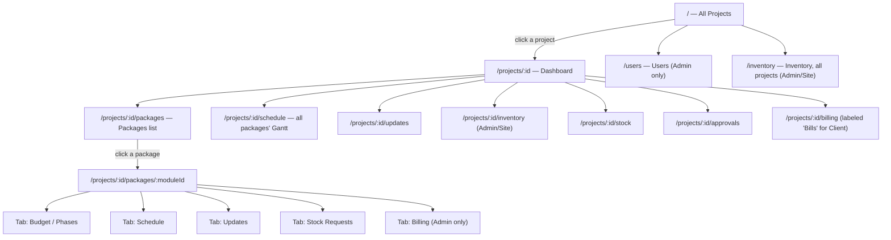
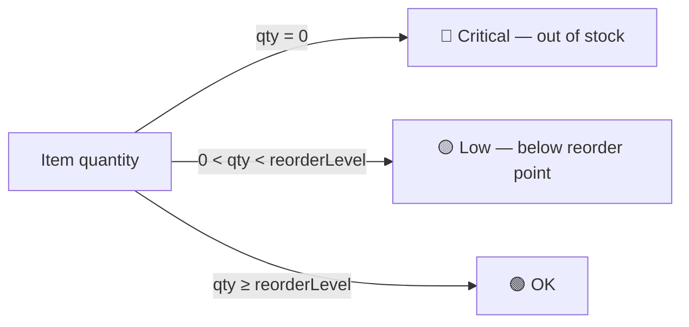
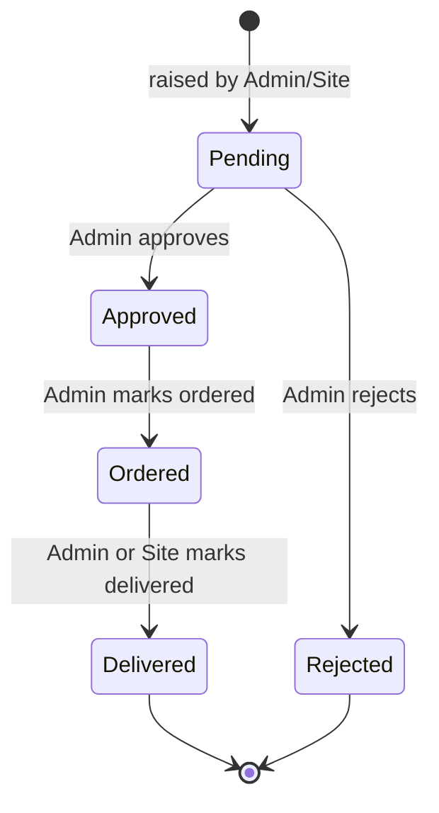
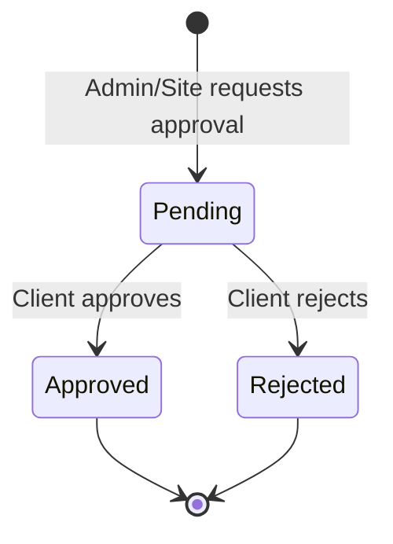
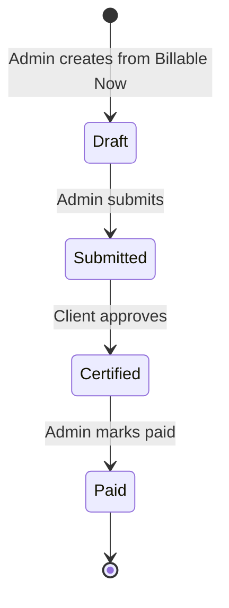
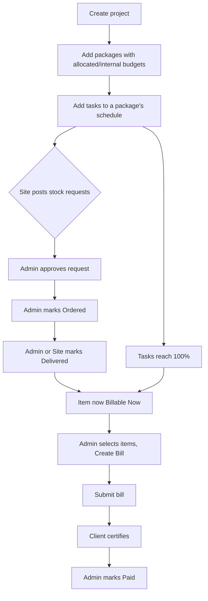
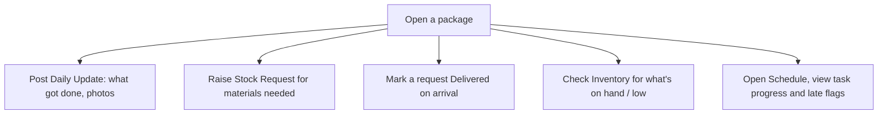
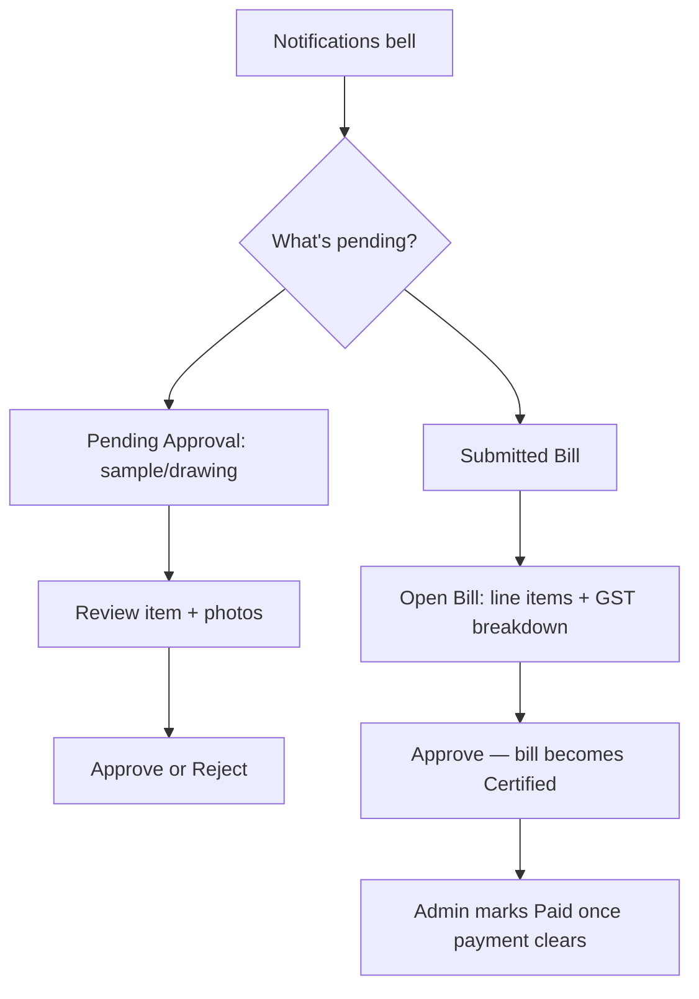

# Apex Projects — UI & Product Guide

A complete reference for the Apex Projects dashboard: what's on screen, what every role can do, how data flows, and why. Written against the actual code in this repo — every table column, button, and formula below is real, not aspirational.

**Stack:** Next.js (App Router) + TypeScript + Tailwind CSS v4, all client-side state (React Context), no backend — a self-contained demo dataset that resets on reload. Strict monochrome theme (light/dark, togglable) with color reserved for status meaning only (green/amber/red).

---

## 1. What the app is

Apex Projects is an internal ops dashboard for **Apex Studios**, an interiors/construction contractor. It tracks multiple client projects (e.g. *BHEL Nagnar Club House*), each broken into **Packages** (Swimming Pool, Facade and Windows, Interiors, MEP...), each package broken into **Phases** (line items with their own budget), each phase optionally broken into **Tasks** on a schedule.

The product answers, for whoever's looking: *what's this project costing, what's happening on site today, what needs my sign-off, and what do we bill next?*

The UI has two levels:
- **All Projects** — a portfolio view across every project.
- **Project Dashboard** — everything about one project, reached by clicking into it.

---

## 2. Roles

Three roles, switchable live from the sidebar (bottom-left, click your name) — this is a demo convenience, not a login system.

| Role | Represents | Seed identity | Sees money? |
|---|---|---|---|
| **Admin** | Apex Studios staff running the job | John Israel Voola, Suresh K, Prakash R, Meena D | Yes — allocated *and* internal cost, margins |
| **Site Supervisor** | On-the-ground crew lead | Ravi | No cost figures — quantities and status only |
| **Client** | The property owner paying for the work | T V Rao (T V Rao Housing Pvt Ltd) | Client price only, never internal cost/margin |

Only **Admin** ever sees the gap between what the client is charged and what the work actually costs — that's the entire reason Admin/Site/Client are different views of the same data rather than one screen with a toggle.

---

## 3. Sitemap

---

## 4. Sidebar — every element

Top to bottom:

1. **Brand** — "Apex Projects" / app.beapex.in, static.
2. **All Projects** — a button, not a link. Click opens a dropdown:
   - "View all projects" (goes to `/`)
   - every project listed by name + client, click jumps straight to that project's Dashboard
   - highlights the project you're currently in
3. **Inventory** *(Admin, Site only)* — standalone link to the business-wide `/inventory` view, tagged **ALL** on the right so it's not confused with the per-project Inventory page below.
4. **Project name** — plain text header, *only rendered once you're inside a project* (hidden on Home/Users/business Inventory, by design — the sidebar shouldn't imply a project is "selected" when you're looking at the portfolio).
5. **Project navigation** *(only when inside a project, filtered by role — see §13)*:
   - Dashboard
   - Packages — expandable (chevron toggle); expands into every package as a numbered sub-item (01, 02, 03…)
   - Schedule
   - Daily Updates
   - Inventory
   - Stock Requests — badge shows count of **Pending** requests (Admin/Site only)
   - Approvals
   - Billing / **Bills** (label changes for Client) — badge shows count of **Submitted** bills, Client only
   - Approvals also badges for Client: count of **Pending** approvals
6. **Studio** *(Admin only)* — group label, contains **Users**.
7. **User card** (bottom-left) — avatar initials, name, role. Click opens an upward menu: **Switch role** with Admin / Site Supervisor / Client, checkmark on whichever is active.

---

## 5. Header

- **Breadcrumb** (left) — `{Project} / {Section}` or `{Project} / Packages / {Package}` for module pages; just "All Projects", "Users", or "Inventory" on those top-level pages.
- **Notifications bell** (right) — badge = count of open items; click for a dropdown, role-scoped (see §9).
- **Theme toggle** (far right) — sun/moon icon button, flips light ↔ dark, remembered via `localStorage`, defaults to your OS setting on first visit.

---

## 6. Pages, in detail

### 6.1 All Projects (`/`)
- Heading + "**+ New Project**" button (Admin only) → *New Project* dialog.
- Stat row, role-dependent:
  - **Admin:** Total Allocated, Total Internal, Committed, Active Projects
  - **Client:** Total Contract Value, Active Projects, Awaiting Your Approval
  - **Site:** Active Projects, Packages in Progress, Pending Requests
- A card per project: name, client, status badge, a Progress bar, a Budget-used bar (Admin only), footer line (`{n} packages · {value} allocated/contract · Started {date}`). Click anywhere on the card to open that project.

### 6.2 Project Dashboard (`/projects/:id`)
- Heading = project name; subtitle = client · location · start date.
- Buttons: **+ Add Package** (Admin), **+ Stock Request** (not Client).
- Stat row, role-dependent:
  - **Admin (5 stats):** Allocated Budget, Internal Budget, Committed, Remaining, Progress
  - **Client (4 stats):** Contract Value, Work Progress, Bills Raised, Awaiting Your Approval
  - **Site (3 stats):** Packages in Progress, Pending Requests, To Receive
- **Packages** table (always shown — see §6.4 for columns).
- **Pending Approvals** card — only if any exist *and* role isn't Site; "View all" jumps to Approvals.
- **Pending Requests** card — only if any exist *and* role isn't Client; "View all" jumps to Stock Requests.
- **Latest Updates** card — last 3 daily updates, "View all" jumps to Daily Updates.

### 6.3 Packages list (`/projects/:id/packages`)
- Heading + "**+ Add Package**" (Admin) → *Add Package* dialog.
- Just the Packages table, full width.

### 6.4 Packages table (shared by 6.2 and 6.3)

| Column | Admin | Site | Client |
|---|:-:|:-:|:-:|
| Package (number, name, lead) | ✅ | ✅ | ✅ |
| Allocated | ✅ | – | ✅ |
| Phases / Open Requests | – | ✅ | – |
| Internal / Committed / Remaining / Used | ✅ | – | – |
| Progress bar | ✅ | ✅ | ✅ |
| Status badge | ✅ | ✅ | ✅ |
| **Total** row (sums) | ✅ | – | ✅ |

Every row is clickable → opens that package's detail page.

### 6.5 Package detail (`/projects/:id/packages/:moduleId`)
- Heading = `{no} {package name}`; subtitle = lead · status · progress %.
- Buttons: **Edit** (Admin) → *Edit Package* dialog · **+ Add Task** (Schedule tab, not Client) · **+ Post Update** (Updates tab, not Client) · **+ Stock Request** (not Client).
- Stat row: same Admin/Client shape as §6.2 but scoped to this one package. **Site sees no stat row here** — straight to the tabs.
- **Tabs:** Budget *(labeled "Phases" for non-Admin)* · Schedule · Updates · Stock Requests *(hidden for Client)* · Billing *(Admin only)*.
  - **Budget/Phases tab:** phase-level table — Allocated/Internal/Committed/Remaining/Used (Admin), Contract Value (Client), Requests count (Site).
  - **Schedule tab:** the Gantt chart for this package (§7).
  - **Updates tab:** daily updates filtered to this package.
  - **Stock Requests tab:** requests filtered to this package.
  - **Billing tab (Admin only):** two tables —
    - *Phase billing status*: Phase, Tasks done, Bill Amount, Status badge, **Mark Complete** button (when a phase has no linked tasks and needs manual sign-off as billable).
    - *Material at Site*: delivered materials — Cost, Client Value, Billable (at 75%), Status.

### 6.6 Schedule (`/projects/:id/schedule`)
- "**Expand all**" / "**Collapse all**" buttons.
- One collapsible card per package: chevron, name, `{n} tasks · {progress}%` or "No plan yet", **+ Add Task** (not Client). Expanding shows that package's Gantt chart.

### 6.7 Daily Updates (`/projects/:id/updates`)
- "**+ Post Update**" button (not Client) → *Post Daily Update* dialog.
- Package filter dropdown.
- A timeline: date, package badge, author, free-text update, up to 4 photo placeholders per entry.

### 6.8 Inventory — project (`/projects/:id/inventory`) and business-wide (`/inventory`)
See §8 — documented together since they're the same table, just scoped differently.

### 6.9 Stock Requests (`/projects/:id/stock`)
- "**+ New Request**" button → *New Stock Request* dialog.
- Status filter tabs: All / Pending / Approved / Ordered / Delivered / Rejected. Package filter dropdown.
- Columns: Request (id, date, requester) · Material (item + package) · Qty · Value *(Admin only)* · Needed By · Status · Actions.
- Actions depend on current status: **Pending** → Approve/Reject (Admin only) · **Approved** → Mark Ordered (Admin) · **Ordered** → Mark Delivered (Admin or Site).

### 6.10 Approvals (`/projects/:id/approvals`)
- "**+ Request Approval**" button (not Client) → *Request Approval* dialog.
- Status filter tabs: Pending / Approved / Rejected / All.
- Columns: Ref · Item (with package, note, up to 4 sample-photo thumbnails) · Type badge · Requested · Needed By · Status (+ decided date once resolved) · Actions.
- Actions: **Client**, when Pending, gets Approve/Reject buttons — this *is* the client sign-off. Everyone else gets an "Add photos" button → *Add Sample Photos* dialog.

### 6.11 Billing (Admin/Site) / Bills (Client) (`/projects/:id/billing`)
**Admin view:**
- Stat row: Billed to Date, Received, Outstanding, Billable Now.
- **Billable Now** card: a checkbox-selectable table of everything ready to bill (delivered materials + completed phases), running total of selected value and margin, "**+ Create Bill**" button.
- **Bills** card: every RA bill for this project — Date, Packages, Taxable, Net Payable, Margin, Status, and per-row actions (View, Upload, and the next status-transition button: Submit → Mark Certified → Mark Paid).

**Client view ("Bills"):**
- Stat row: Bills Raised, Awaiting Approval, Approved Unpaid, Paid.
- Bills table: Date, Packages, Taxable, GST, Net Payable, Status, View, and **Approve** when a bill is Submitted (this is the client certifying it).

**Bill detail dialog** (both roles, "View"): line items (description, client value, %, amount), a summary (Gross → less previously-billed material → Taxable → less 5% retention → +18% GST → **Net Payable**), the uploaded bill file(s) with an Upload button (not Client), and — Admin only — an "Internal" box with cost and margin for that bill. Footer button: "Download PDF" (Client) or "Download Excel" (Admin/Site).

### 6.12 Users (`/users`, Admin only)
- "**+ Invite User**" button → *Invite User* dialog.
- Table: avatar + name, contact, a role dropdown (changes live), Remove button (demo-only — doesn't actually delete).

---

## 7. The Gantt chart (Schedule)

Each package's schedule renders as a 14-week grid, grouped by phase (collapsible), with month headers and a **today column highlighted in red**. Task bars show progress as a filled portion; a task running past its week without hitting 100% gets a dashed outline and a **late** flag. Clicking a bar opens the *Task Detail* dialog to edit progress/dates — except for Client, who gets a read-only toast (`"{task}: {progress}% complete"`) instead, since Client can't edit schedules.

---

## 8. Inventory management

Two views over the same `InventoryItem` records (item, category, quantity on hand, unit, reorder level, unit cost, location), visible to **Admin and Site only**:

- **Per-project** (`/projects/:id/inventory`) — one project's stock.
- **Business-wide** (`/inventory`, sidebar-tagged **ALL**) — every project's stock in one table with a Project column and a project filter, for a studio-wide view.

Both show the same stat row (Total Items, Total Value, Low Stock count, Critical count) and the same table (Item + category, On Hand, Reorder Level, Value, Location, Status).

**Status is derived, not stored:**

Value = quantity × unit cost, summed for the "Total Value" stat.

---

## 9. Notifications

The bell icon aggregates live, role-scoped items from across **every** project (not just the one you're viewing) — built fresh from current data each time you open it, nothing is "marked read":

| Role | Sees |
|---|---|
| Admin | Pending stock requests · Bills Submitted (ready to certify) · Inventory items that are Low or Critical |
| Site | Pending stock requests · Inventory items that are Low or Critical |
| Client | Approvals Pending (need their sign-off) · Bills Submitted (awaiting their approval) |

Each entry is a link straight to the relevant project's relevant page.

---

## 10. Status badge legend

Color is reserved entirely for status — everything else in the UI is grayscale.

| Variant | Look | Used for |
|---|---|---|
| 🟢 **success** | green | Delivered, Approved (approval), Paid (bill/phase), OK (inventory) |
| 🟡 **warning** | amber | Pending (request/approval), Submitted (bill), Billable (phase) |
| 🔴 **destructive** | red | Rejected, Over budget (package), Critical (inventory) |
| ⚫ **default** | solid black/white | Approved (request), Certified (bill), Billed (phase), In progress (package) |
| ⬜ **secondary** | flat gray | Draft (bill), Not started/Design (package), unresolved phase |
| ▢ **outline** | bordered, no fill | Ordered (request), badge-type tags (Material sample, Milestone, etc.) |

---

## 11. Business rules & formulas

- **Money formatting:** Indian digit grouping (`₹1,23,456`); compact form switches to **L** (Lakh, ≥ ₹1,00,000) and **Cr** (Crore, ≥ ₹1,00,00,000) for stat tiles.
- **Committed** (per package) = sum of `qty × rate` for every stock request in that package with status Approved, Ordered, *or* Delivered.
- **Remaining** = Internal Budget − Committed.
- **Progress** = task-duration-weighted average of `%complete` across a package's tasks (a 3-week task counts 3× a 1-week task).
- **Billing constants:** GST **18%**, Retention **5%**, Material-at-site billable at **75%** of its client value.
- A **phase becomes billable** when every one of its tasks hits 100%, *or* it's been marked complete manually (for phases with no linked tasks), *or* — for materials — a stock request reaches Delivered.
- **Bill math**, top to bottom: Gross (sum of selected line values) → minus **recovery** (material already billed for a phase now being billed as a completed milestone, to avoid double-billing) → **Taxable value** → minus 5% retention → plus 18% GST → **Net Payable**.
- **Cost→client factor**: `alloc ÷ internal` for a phase (or module, if the phase has no internal figure) — this is what converts a material's internal cost into its client-billable value.

---

## 12. Permission matrix

| Section | Admin | Site | Client |
|---|:-:|:-:|:-:|
| Dashboard | ✅ | ✅ | ✅ |
| Packages | ✅ | ✅ | ✅ |
| Schedule | ✅ | ✅ | ✅ |
| Daily Updates | ✅ | ✅ | ✅ |
| Inventory (project + business) | ✅ | ✅ | – |
| Stock Requests | ✅ | ✅ | – |
| Approvals | ✅ | ✅ | ✅ |
| Billing / Bills | ✅ | – | ✅ |
| Users | ✅ | – | – |
| Sees internal cost / margin | ✅ | – | – |
| Approve stock requests | ✅ | – | – |
| Approve/reject approvals | – | – | ✅ |
| Approve (certify) bills | – | – | ✅ |
| Mark Ordered / Delivered | ✅ | Delivered only | – |

---

## 13. Lifecycle state diagrams

**Stock Request**

**Approval** (client sign-off on samples/makes/drawings)

**Bill**

---

## 14. User flows

**Admin — running a project**

**Site Supervisor — daily work**

**Client — reviewing and paying**

---

## 15. User stories

### Admin
| As an Admin, I want to… | So that… |
|---|---|
| See allocated vs. internal budget per project and package | I know our margin at a glance |
| Add a new project with its packages | New jobs get set up in minutes |
| Edit a package's budget, lead, and status | Numbers stay current as scope changes |
| Build out a schedule with tasks per phase | The team knows what's due when |
| Approve or reject stock requests | Nothing gets ordered without sign-off |
| Track material delivery status | I know what's actually on site |
| See inventory levels across all projects in one place | I can spot shortages before they stall work |
| Select delivered materials and completed phases into a bill | Billing reflects only what's actually done |
| Submit a bill, then mark it Paid once cleared | The RA bill cycle is tracked end to end |
| Upload the signed bill PDF | The client has the paperwork on file |
| Invite a new team member and set their role | Access matches who's actually on the job |
| See a bell-icon summary of pending requests, bills, and low stock across every project | I don't have to check each project separately |

### Site Supervisor
| As a Site Supervisor, I want to… | So that… |
|---|---|
| Post a daily update with photos | Office and client have visibility without a site visit |
| Raise a stock request when material runs low | Ordering isn't delayed by me forgetting to flag it |
| Mark a request Delivered when it arrives | The record matches reality |
| Check current inventory before requesting more | I don't over-order what's already on hand |
| View the schedule and see which tasks are late | I know what to prioritize today |
| Update task progress as work completes | The Gantt chart reflects real progress |
| See approvals still pending with the client | I know what's blocking the next step |

### Client
| As a Client, I want to… | So that… |
|---|---|
| See overall progress and contract value per project | I know where my money and timeline stand |
| Review a sample/material/drawing with photos before it's used | I approve what actually gets built |
| Approve or reject an approval request | My preferences are captured, not assumed |
| Open a bill and see the GST/retention breakdown | I understand exactly what I'm being asked to pay |
| Approve (certify) a bill | Payment can proceed once I've signed off |
| See which bills are still awaiting my action | Nothing sits unpaid because I missed it |
| Get a single notifications view of pending approvals and bills | I don't have to hunt through each project |

---

## 16. Dialogs — full reference

| Dialog | Opened from | Fields | On submit |
|---|---|---|---|
| **New Project** | All Projects → "+ New Project" | Project Name, Client, Location, Start Date, Packages (comma-separated) | Creates project, navigates to its Dashboard |
| **Add Package** | Dashboard/Packages → "+ Add Package" | Package Name, Allocated Budget, Internal Budget, Lead | Adds package to the project |
| **Edit Package** | Package detail → "Edit" | Package Name, Allocated Budget, Internal Budget, Lead, Status | Updates the package |
| **Add Task** | Schedule tab / Schedule page → "+ Add Task" | Task, Phase, Owner, Start Week, Duration (weeks) | Adds a task to the Gantt |
| **Task Detail** | Click a Gantt bar | Progress (slider), Start Week, Duration (weeks), Note | Updates the task |
| **New Stock Request** | "+ Stock Request" (several pages) | Package, Phase, Material (with suggestions), Quantity + unit, Needed By, Rate *(Admin only)*, Note | Creates request, goes to Stock Requests |
| **Request Approval** | Approvals → "+ Request Approval" | Package, Phase, Type, Needed By, Item, Note, Sample Photos | Creates approval, goes to Approvals |
| **Add Sample Photos** | Approvals table → "Add photos" | Photos | Appends photo count to that approval |
| **Post Daily Update** | "+ Post Update" (several pages) | Package, Date, Work Done, Photos | Creates update, goes to Daily Updates |
| **Upload Bill Copy** | Billing → "Upload" | Bill PDF / image (multi-file) | Attaches file(s) to the bill |
| **View Bill** | Billing → "View" | *(read-only)* | Download PDF/Excel (toast only, demo) |
| **Invite User** | Users → "+ Invite User" | Name, Email or Phone, Role | Adds the person to the team table |

---

*This document describes the app as implemented in this repository — regenerate/update it if the UI changes underneath it.*
