# ER Diagram

Generated from `supabase/migrations/*.sql` (the schema source of truth) as of
2026-09-17. Column details, enums, views and constraints are in
[db-schema.md](db-schema.md).

**How to read it**

- Solid lines are real foreign keys.
- Dashed lines are links the app relies on but the database does not enforce:
  `attachments.entity_id`, `bill_lines.source_id`, `stock_movements.ref_id` and
  `stock_requests.billed_on_bill_id`.
- Left out to keep it readable: the `org_id → orgs` link on nearly every business
  table, the `created_by` / `updated_by → profiles` links, and most
  `created_at` / `updated_at` columns. `audit_log` has no foreign keys.

```mermaid
erDiagram
    auth_users ||--|| profiles : "is"
    orgs ||--o{ profiles : employs
    orgs ||--o{ clients : has
    orgs ||--o{ projects : owns
    orgs ||--o{ inventory_items : stocks
    orgs |o--o{ jobs : queues

    clients ||--o{ projects : commissions
    projects ||--o{ project_members : has
    profiles ||--o{ project_members : "member of"

    projects ||--o{ packages : "split into"
    packages ||--o{ phases : "split into"
    phases ||--o{ tasks : "split into"
    profiles |o--o{ packages : leads
    profiles |o--o{ tasks : owns

    units ||--o{ inventory_items : "measured in"
    projects |o--o{ inventory_items : "null = central store"
    inventory_items ||--o{ stock_movements : ledger
    projects |o--o{ stock_movements : "moved for"

    projects ||--o{ stock_requests : raises
    packages ||--o{ stock_requests : for
    phases |o--o{ stock_requests : for
    inventory_items |o--o{ stock_requests : "null = new material"
    units ||--o{ stock_requests : "measured in"
    profiles ||--o{ stock_requests : requests
    stock_requests ||--o{ stock_request_events : history

    projects ||--o{ approvals : raises
    packages ||--o{ approvals : for
    phases |o--o{ approvals : for
    approvals |o--o| approvals : supersedes
    profiles ||--o{ approvals : requests

    projects ||--o{ daily_updates : logs
    packages ||--o{ daily_updates : for
    profiles ||--o{ daily_updates : authors

    projects ||--o{ bills : billed
    bills ||--o{ bill_lines : contains
    bills ||--o{ bill_events : history
    bills ||--o{ payments : "settled by"
    bills |o..o{ stock_requests : "billed_on_bill_id (no FK)"
    phases |o..o{ bill_lines : "source_id (polymorphic)"
    stock_requests |o..o{ bill_lines : "source_id (polymorphic)"

    projects |o--o{ attachments : scopes
    approvals |o..o{ attachments : "entity_id (polymorphic)"
    daily_updates |o..o{ attachments : "entity_id"
    bills |o..o{ attachments : "entity_id"
    stock_requests |o..o{ attachments : "entity_id"
    profiles ||--o{ attachments : uploads
    profiles ||--o{ rate_limits : "throttled by"

    orgs {
        uuid id PK
        text name
        text legal_name
        text gstin
        text pan
        text address
        text logo_r2_key
        text bank_name
        text bank_account_no
        text bank_ifsc
        timestamptz created_at
    }
    profiles {
        uuid id PK, FK "auth.users"
        uuid org_id FK
        text full_name
        text email "email or phone required"
        text phone
        app_role role "default site"
        boolean is_active
        timestamptz last_seen_at
        timestamptz created_at
        timestamptz updated_at
        timestamptz deleted_at
    }
    clients {
        uuid id PK
        uuid org_id FK
        text name
        text contact_person
        text email
        text phone
        text gstin
        text billing_address
        timestamptz created_at
        timestamptz updated_at
        timestamptz deleted_at
    }
    projects {
        uuid id PK
        uuid org_id FK
        uuid client_id FK
        text code UK "org_id+code, e.g. BHEL-NCH"
        text name
        text location
        project_status status
        date start_date
        date target_end_date
        timestamptz completed_at
        numeric contract_value
        numeric gst_rate_pct "18"
        numeric retention_pct "5"
        numeric mas_billable_pct "75"
        numeric tds_pct "0"
        numeric mobilisation_advance
        numeric mobilisation_recovered
        numeric mobilisation_recovery_pct
        smallint progress_pct "trigger cache"
        int next_bill_seq
        int next_sr_seq
        int next_ap_seq
        uuid created_by FK
        uuid updated_by FK
        timestamptz deleted_at
    }
    project_members {
        uuid project_id PK, FK
        uuid profile_id PK, FK
        timestamptz added_at
        uuid added_by FK
    }
    packages {
        uuid id PK
        uuid org_id FK
        uuid project_id FK
        int seq_no UK "project_id+seq_no"
        text name
        uuid lead_profile_id FK
        numeric allocated_amount "client-facing"
        numeric internal_amount "ADMIN ONLY"
        package_status status
        smallint progress_pct "trigger cache"
        timestamptz deleted_at
    }
    phases {
        uuid id PK
        uuid org_id FK
        uuid project_id FK
        uuid package_id FK
        int seq_no UK "package_id+seq_no"
        text name
        numeric allocated_amount
        numeric internal_amount "ADMIN ONLY"
        phase_billing_status billing_status
        timestamptz manual_complete_at
        uuid manual_complete_by FK
        timestamptz deleted_at
    }
    tasks {
        uuid id PK
        uuid org_id FK
        uuid project_id FK "denormalised for RLS"
        uuid package_id FK "denormalised for RLS"
        uuid phase_id FK
        text name
        uuid owner_profile_id FK
        date start_date
        int duration_weeks "1-104"
        date end_date "generated"
        smallint progress_pct
        text note
        timestamptz deleted_at
    }
    units {
        text code PK
        text label
        int sort_order
    }
    inventory_items {
        uuid id PK
        uuid org_id FK
        uuid project_id FK "nullable"
        text name
        text category
        text sku UK "org+project+sku, nulls not distinct"
        text unit FK
        numeric qty_on_hand ">= 0, cache of movements"
        numeric reorder_level
        numeric unit_cost "never client"
        text location
        timestamptz deleted_at
    }
    stock_movements {
        uuid id PK
        uuid org_id FK
        uuid inventory_item_id FK
        uuid project_id FK
        movement_direction direction
        numeric qty "> 0"
        numeric unit_cost
        text ref_type
        uuid ref_id "polymorphic"
        text reason
        timestamptz created_at
        uuid created_by FK
    }
    stock_requests {
        uuid id PK
        uuid org_id FK
        uuid project_id FK
        uuid package_id FK
        uuid phase_id FK
        text ref_no UK "SR-BHEL-NCH-014"
        uuid inventory_item_id FK
        text material_name
        numeric qty
        text unit FK
        numeric rate "ADMIN ONLY"
        date needed_by
        text note
        stock_request_status status
        uuid requested_by FK
        uuid approved_by FK
        timestamptz approved_at
        timestamptz ordered_at
        uuid delivered_by FK
        timestamptz delivered_at
        text rejected_reason
        uuid billed_on_bill_id
        timestamptz deleted_at
    }
    stock_request_events {
        uuid id PK
        uuid request_id FK
        stock_request_status from_status
        stock_request_status to_status
        uuid actor_id FK
        text note
        timestamptz created_at
    }
    approvals {
        uuid id PK
        uuid org_id FK
        uuid project_id FK
        uuid package_id FK
        uuid phase_id FK
        text ref_no UK "AP-BHEL-NCH-007"
        approval_type type
        text item
        text note
        date needed_by
        approval_status status
        uuid requested_by FK
        uuid decided_by FK
        timestamptz decided_at
        text decision_reason
        uuid supersedes_id FK
        timestamptz deleted_at
    }
    daily_updates {
        uuid id PK
        uuid org_id FK
        uuid project_id FK
        uuid package_id FK
        date update_date
        text body
        uuid author_id FK
        timestamptz deleted_at
    }
    bills {
        uuid id PK
        uuid org_id FK
        uuid project_id FK
        int seq_no UK "project_id+seq_no"
        text bill_no UK "RA-BHEL-NCH-03"
        date bill_date
        date period_from
        date period_to
        bill_status status
        int revision
        numeric work_value "A"
        numeric material_value "B"
        numeric gross_amount "C = A+B"
        numeric mas_recovery_amount "D"
        numeric taxable_amount "E = C-D"
        numeric gst_amount "F"
        numeric invoice_total "G = E+F"
        numeric retention_amount "H"
        numeric tds_amount "I"
        numeric advance_recovery "J"
        numeric net_payable "K = G-H-I-J"
        numeric gst_rate_pct "snapshot"
        numeric retention_pct "snapshot"
        numeric tds_pct "snapshot"
        numeric internal_cost_amount "ADMIN ONLY"
        numeric margin_amount "ADMIN ONLY"
        text notes
        text idempotency_key
        uuid created_by FK
        timestamptz submitted_at
        uuid submitted_by FK
        timestamptz certified_at
        uuid certified_by FK
        text certification_note
        timestamptz paid_at
        timestamptz deleted_at
    }
    bill_lines {
        uuid id PK
        uuid bill_id FK
        bill_line_source source_type
        uuid source_id "phase or stock_request"
        text description
        numeric client_value
        numeric pct_billed
        numeric amount
        numeric internal_cost "ADMIN ONLY"
        int sort_order
    }
    bill_events {
        uuid id PK
        uuid bill_id FK
        bill_status from_status
        bill_status to_status
        uuid actor_id FK
        text note
        timestamptz created_at
    }
    payments {
        uuid id PK
        uuid org_id FK
        uuid bill_id FK
        numeric amount "> 0"
        date paid_on
        text mode "neft/cheque/upi/rtgs"
        text reference_no
        text note
        text idempotency_key
        uuid created_by FK
        timestamptz created_at
    }
    attachments {
        uuid id PK
        uuid org_id FK
        uuid project_id FK
        attachment_entity entity_type
        uuid entity_id "polymorphic"
        text r2_key UK
        text thumb_r2_key
        text file_name
        text mime_type
        bigint size_bytes "max 25 MB"
        uuid uploaded_by FK
        timestamptz deleted_at
    }
    audit_log {
        bigserial id PK
        uuid org_id
        uuid actor_id
        app_role actor_role
        text entity_type
        uuid entity_id
        text action
        jsonb before
        jsonb after
        inet ip
        timestamptz created_at
    }
    jobs {
        uuid id PK
        uuid org_id FK
        text name UK "name+idempotency_key"
        job_status status
        jsonb payload
        text idempotency_key
        int attempts
        int max_attempts
        timestamptz run_after
        timestamptz lease_until
        text last_error
        timestamptz started_at
        timestamptz finished_at
    }
    rate_limits {
        uuid profile_id PK, FK
        text action PK
        timestamptz window_start
        int count
    }
```

