# Apex Projects — System Overview

One page for the whole system. Diagrams first, prose only where a diagram can't say it.
Detail lives in `01-hld.md` (domain), `02-lld.md` (schema), `architecture.md` (operations).

---

## 1. What it is

Apex Studios is an interiors contractor. This platform is the single record of its jobs —
budgets, site work, materials, client sign-off, and RA billing.

**The one rule everything else serves:** only Admin sees the gap between what the client is
charged (`allocated`) and what the work costs (`internal`). Three roles, one dataset, three
different truths.

---

## 2. System context

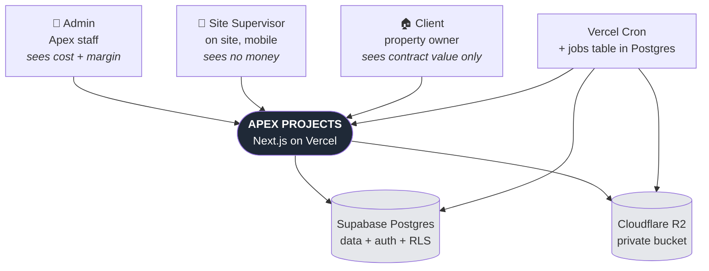

Accounting stays external — humans move exported XLSX to Tally/Zoho. No integration in v1.
No email in v1 either: notification is the in-app bell, read live from the database.

---

## 3. Domain hierarchy

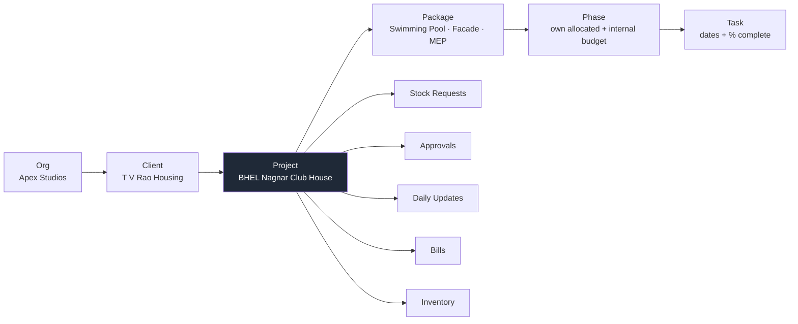

Money lives on **packages and phases**. Progress rolls **up** from tasks. Billing draws from
completed phases and delivered materials.

---

## 4. Data model

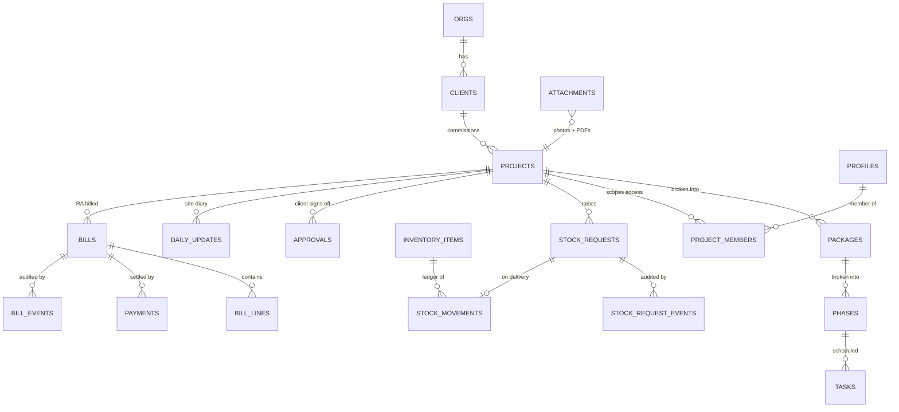

Three tables are **append-only for every role including owner**: `audit_log`,
`stock_movements`, `bill_events`. History that can be edited is not evidence.

---

## 5. How a request is handled

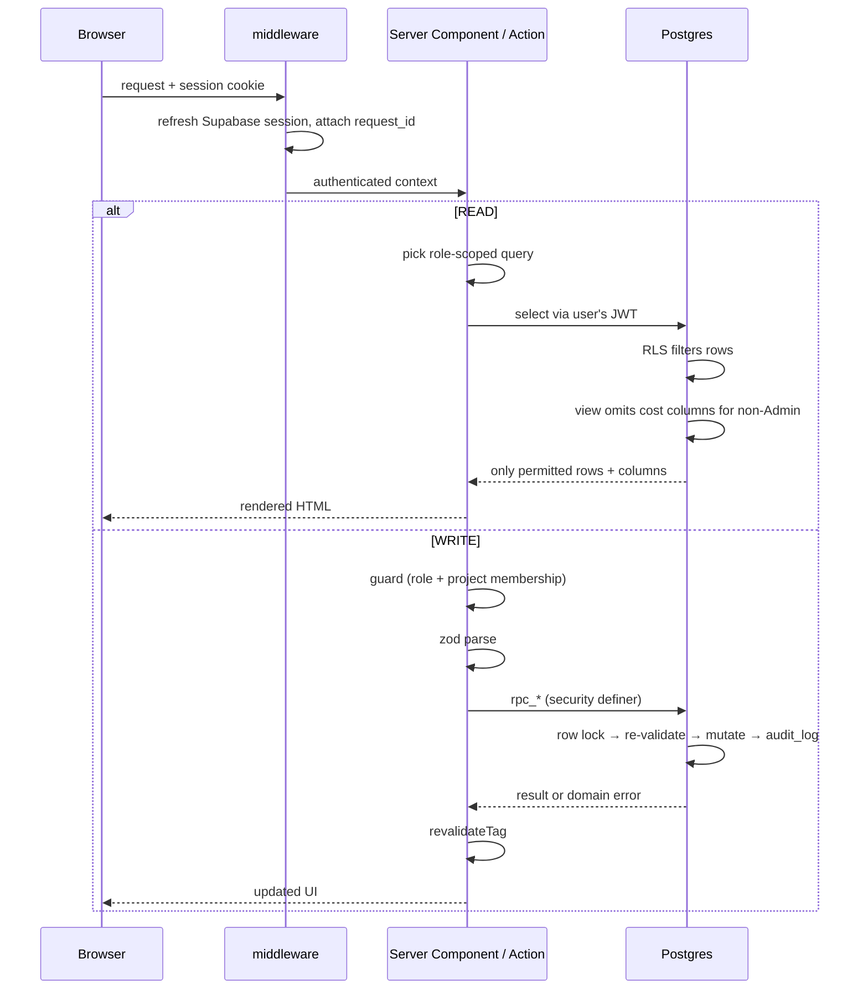

**Money and stock never move through application read-modify-write.** Every such mutation is
a Postgres function that takes a row lock and re-checks current state.

---

## 6. How permission is decided

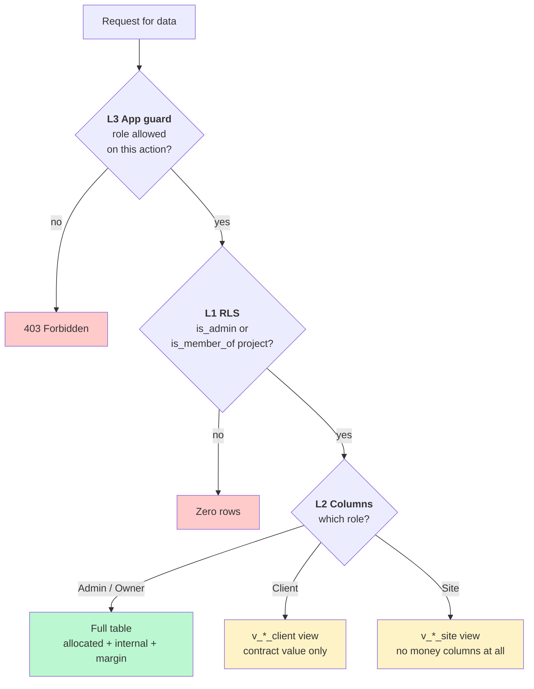

L2 is the unusual one and the reason the product works: for a non-Admin the cost column is
**not in the select list**. It isn't hidden in the UI — it never enters the response body, so
a React bug cannot leak it.

---

## 7. Stock request lifecycle

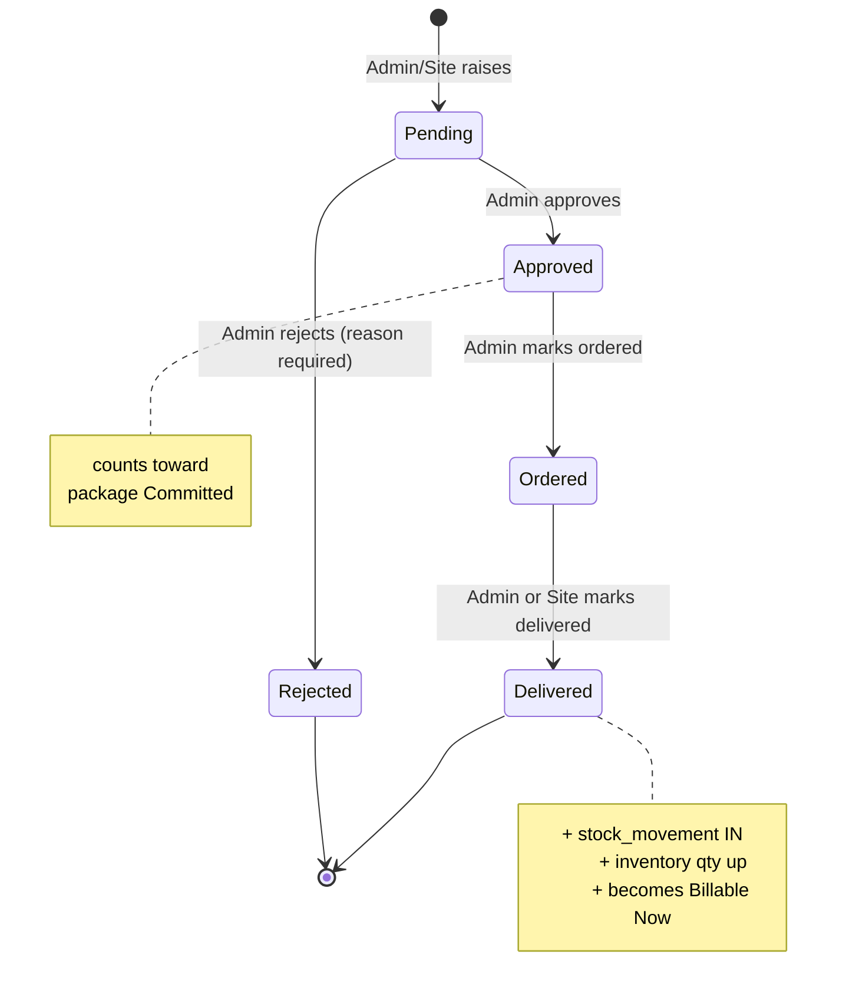

Illegal jumps (Pending → Delivered) are rejected by the RPC, not just hidden in the UI.

---

## 8. Approval lifecycle

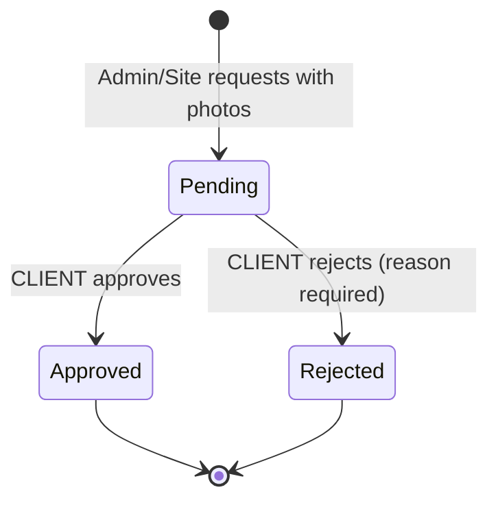

Only a Client can decide. Once decided, the record and its photos freeze — this is the
evidence trail for "you approved this finish". A rejected item is superseded by a new
approval, never reopened.

---

## 9. Bill lifecycle

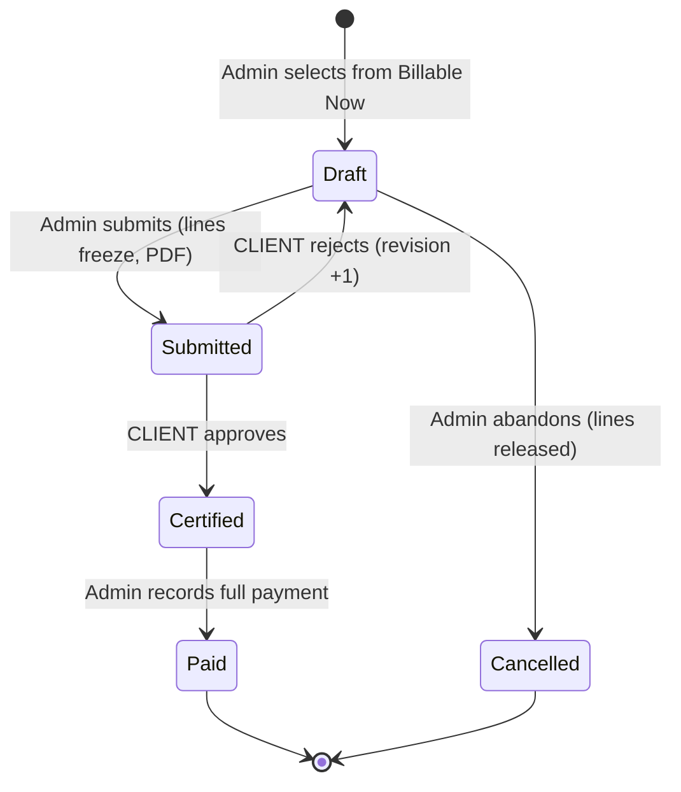

**Admin cannot certify. Client cannot create.** That separation is what gives the audit trail
its commercial meaning. Issued bills are immutable — corrections go on the next RA bill.

---

## 10. Billing arithmetic

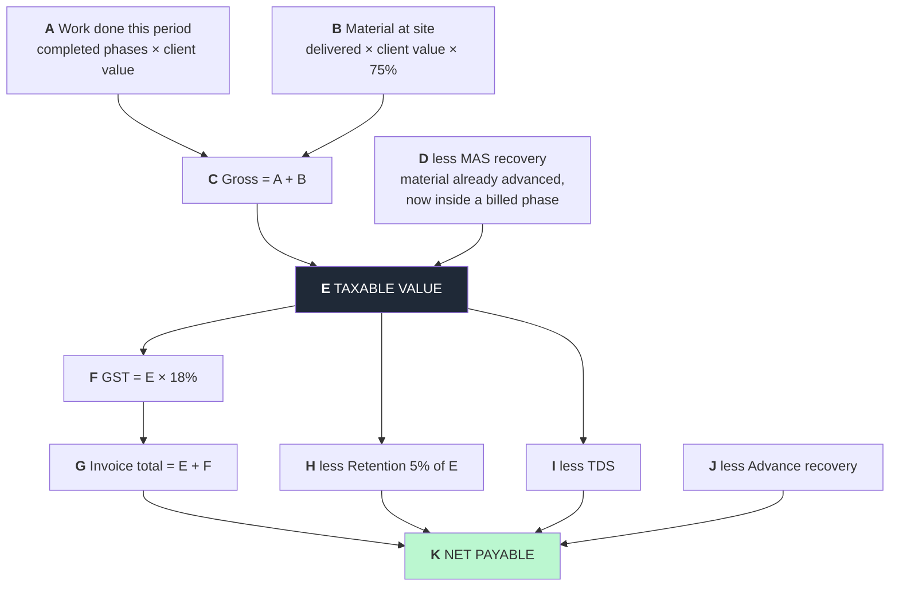

**GST is charged on E, before retention is deducted.** Retention money is still part of the
value of the supply, so tax is payable on it even though the cash is withheld. The prototype
deducted retention first, which understated output tax — that's corrected here.

Rates are snapshotted onto each bill at creation, so a later project-level change never
restates an issued invoice.

---

## 11. What each role does

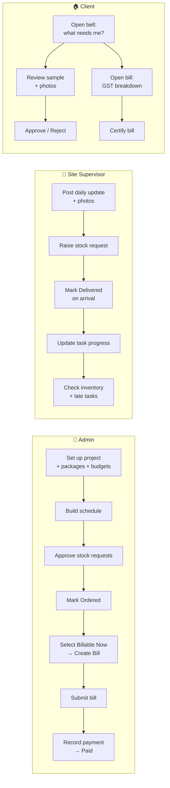

---

## 12. Progress and billability rollup

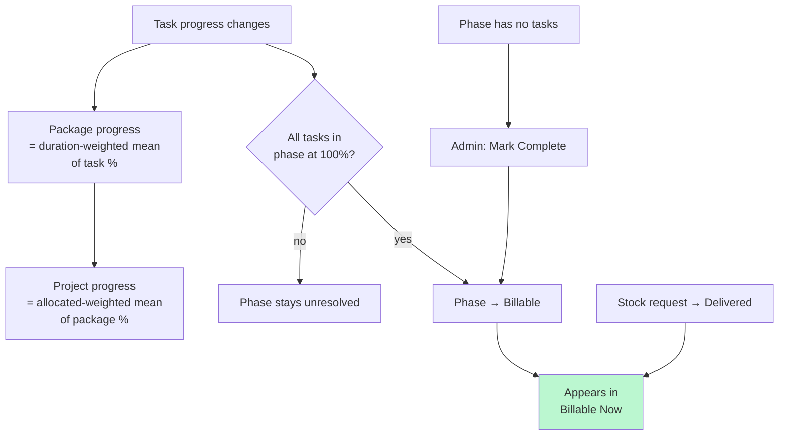

A 3-week task counts 3× a 1-week task. A ₹40L package moves the project needle 20× more than
a ₹2L one.

---

## 13. File upload

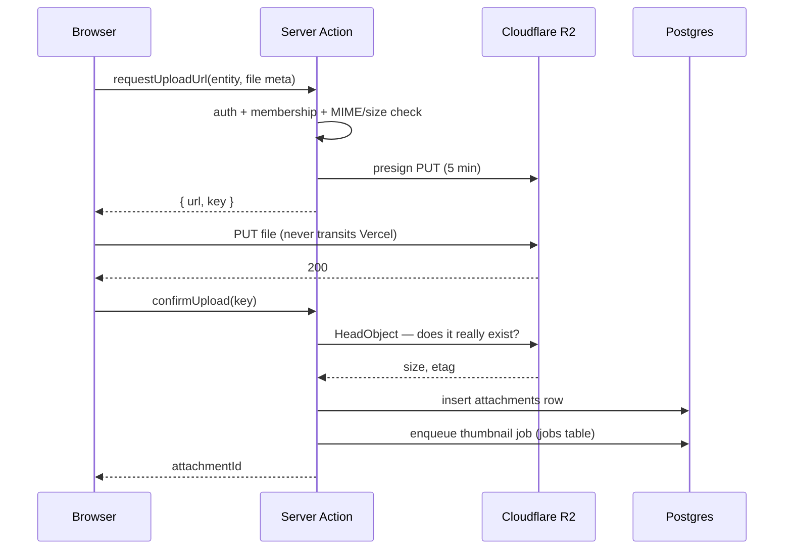

The confirm step matters: without it, an abandoned upload leaves a database row pointing at
nothing. We only record what we can verify. Reads are presigned GET, 15-minute TTL, issued
after an access check. No public bucket, ever.

---

## 14. Background jobs

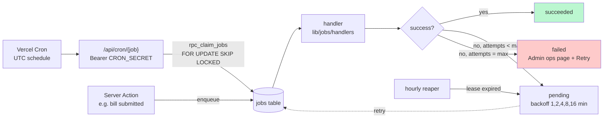

| Job | When | Why it matters |
|---|---|---|
| `backup.nightly` | 01:00 IST | **Only recovery point. Failure is P1.** |
| `inventory.reconcile` | 02:00 IST | Cache vs `stock_movements` ledger drift |
| `jobs.drain` | every minute | Picks up queued thumbnails and bill PDFs |
| `jobs.reap` | hourly | Requeues jobs whose worker timed out |
| `attachment.orphan_sweep` · `project.archive` | weekly | Housekeeping |

State lives in Postgres, not the scheduler — a missed tick delays work, never loses it.
Per-minute cron requires Vercel Pro.

---

## 15. Deployment

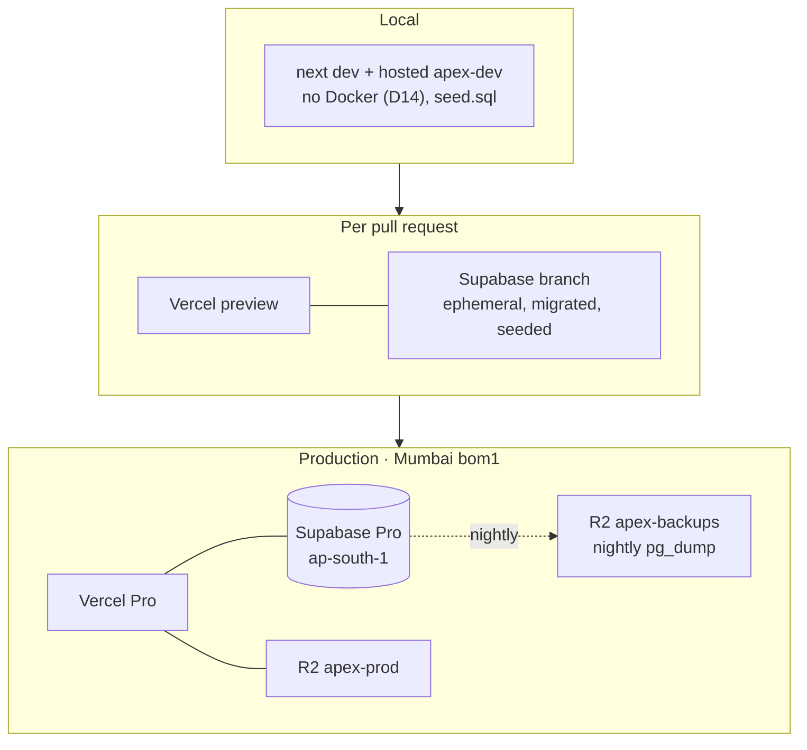

Vercel and Supabase are co-located — cross-region round trips would dominate P95. There is no
long-lived staging tier; preview branches give migration safety with nothing to maintain.

---

## 16. CI/CD

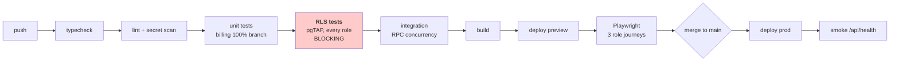

Code rolls back instantly via Vercel. **Schema does not roll back** — migrations are
forward-only and must stay compatible with the previous code version, which is why every
breaking change goes expand → migrate → contract.

---

## 17. Failure behaviour

```mermaid
flowchart TD
    F{What broke?} --> PG[Postgres] --> TOTAL["🔴 Total outage"]
    F --> VC[Vercel] --> TOTAL
    F --> R2X[R2] --> P1["🟡 Uploads/downloads fail<br/>rest of app fine"]
    F --> CR["Vercel Cron"] --> P2["🟡 PDFs + thumbnails delayed<br/>work stays queued in Postgres<br/><b>nothing lost</b>"]

    style TOTAL fill:#fecaca
```

Only Postgres and Vercel are single points of failure. Job state lives in the `jobs` table,
not in the scheduler, so a missed cron tick delays work rather than losing it — the next tick
drains the backlog. Notifications are computed live from a database view, so there is no
notification pipeline that can go stale.

---

## 18. Concurrency guards

| Race | Guard |
|---|---|
| Two supervisors mark one request Delivered | `SELECT … FOR UPDATE` + status re-check in the RPC |
| Two Admins create bills at once | Row lock on `projects` serialises `next_bill_seq` — gapless numbers |
| Same phase billed twice | Unique index on `bill_lines(source_type, source_id)` |
| Double-click submit | Client idempotency key on `createBill` / `recordPayment` |
| Two Admins edit one package | Optimistic `updated_at` check → "changed by someone else" |
| Inventory cache drifts from ledger | Nightly reconcile recomputes from `stock_movements`, alerts on delta |

---

## 19. Where to go next

| Question | File |
|---|---|
| What are the business rules? | `01-hld.md` |
| What's the exact schema / policy / RPC? | `02-lld.md` |
| How do I deploy, monitor, restore? | `architecture.md` |
| What are the coding rules? | `../AGENTS.md` |
| What's still undecided? | `01-hld.md` §18 and `architecture.md` §16 |